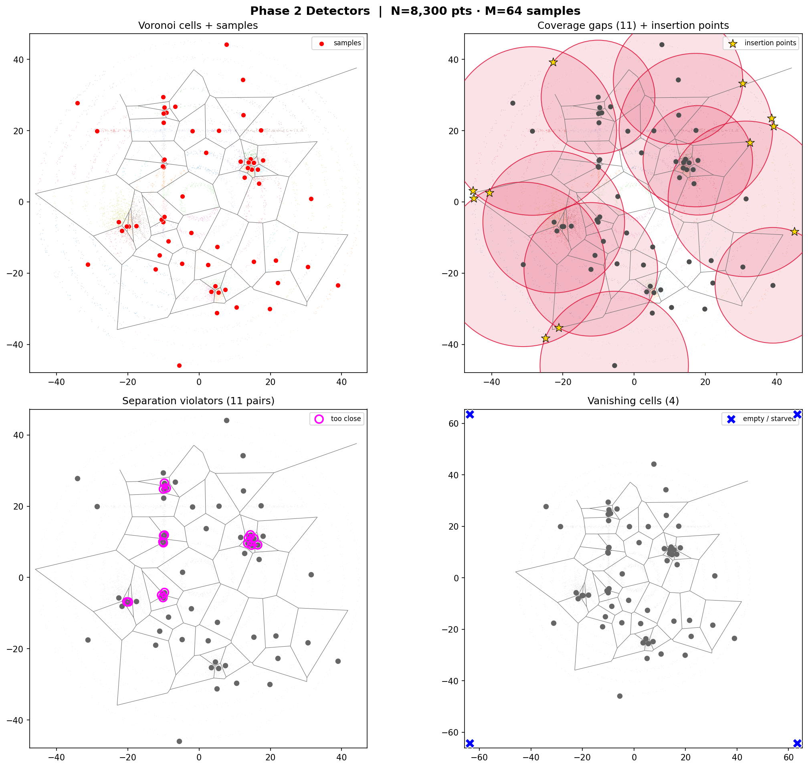

# FPS-Voronoi — adaptive point-cloud sampling

## The big picture

When you process a 3-D point cloud (say, a LiDAR scan with hundreds of thousands
of points), you usually can't afford to work with every point. You pick a much
smaller set of representative **samples** and work with those instead.

A common way to pick them is **Farthest Point Sampling (FPS)**: start somewhere,
then keep adding the point that is farthest from everything chosen so far. This
spreads samples out nicely, but it's purely geometric — it doesn't know whether
the result actually does a *good job* of representing the cloud. Some regions can
end up under-covered, some samples can land almost on top of each other, and some
samples can end up representing almost nothing.

This project is building a system that **checks the quality of a sampling and
tells you how to improve it**. The idea:

1. Pick samples `S` from the cloud `P` (FPS).
2. Each cloud point "belongs to" its nearest sample. This silently carves the
   cloud into regions — one per sample — called **Voronoi cells**. (We never
   build the cells explicitly; we just ask which sample each point is closest
   to.)
3. Measure the health of those cells and flag three kinds of problems:
   - **Coverage gaps** — a cell stretches over too large an area → we're
     under-sampling there, add a sample.
   - **Separation violations** — two samples sit redundantly close → wasteful,
     drop one.
   - **Vanishing cells** — a sample represents (almost) no points → wasted
     sample, remove or move it.
4. (Future work) Act on those flags — insert/remove samples and repeat — so the
   sampling *adapts* to the actual shape of the data.

So the end goal is an **adaptive resampler**: instead of trusting raw FPS, we
keep refining the sample set until the cloud is covered evenly and efficiently.

---

## What's been built so far

The work is split into phases. Each phase lives in its own folder with its own
detailed README.

### Phase 1 — the measuring tools (`phase_1/`)

Five small, independent building blocks that each answer one geometric question
about the cloud-and-samples, all running on CPU or GPU:

| Tool | Description |
|------|-----------------------------------|
| **cell membership** | Which sample is each cloud point closest to, and how far? |
| **covering radius** | How far does each cell reach? (its most distant point) |
| **min pairwise distance** | Which two samples are closest together? |
| **cell occupancy** | How many points does each sample actually represent? |
| **Delaunay neighbors** | Which samples are neighbours of which? |

These are the raw instruments. On their own they just report numbers — they
don't make any judgements yet. Each one is carefully tested (including
checks that the CPU and GPU give identical answers).

### Phase 2 — fusing the tools and making judgements (`phase_2/`)

Phase 2 does two things.

**First, it fuses the measurements into a single efficient pass.** In Phase 1,
finding each point's nearest sample, measuring how far cells reach, and counting
points per cell were three separate sweeps over the data. The expensive part —
comparing every point against every sample — was repeated. Phase 2 does all of
that in **one sweep**: it computes:

- the nearest sample,
- the distance,
- the per-cell reach,
- the per-cell point count, and
- even *which* point sits farthest out in each cell

ALL AT ONCE. This is the performance win that makes the system practical on
large clouds, and it's structured so a hand-written GPU kernel can slot in later.

**Second, it turns measurements into decisions.** Three detectors apply
thresholds to the fused statistics and flag problem cells:

- **Coverage gap detector** → lists the over-stretched cells *and* hands back a
  concrete point where a new sample should be inserted.
- **Separation violator detector** → lists the sample pairs that are too close.
- **Vanishing cell detector** → lists the samples that represent too few points.

The thresholds can be set to exact values, or derived automatically from the
data (e.g. "flag anything more than twice the typical cell size"), so the system
adapts to whatever cloud it's given.

Phase 2 also ships a visualization that draws all three problems on a 2-D scene,
so you can *see* where the sampling is weak:



### Phase 3 — acting on the flags (`phase_3/`)

Phase 2 only *reports* problems. Phase 3 **fixes** them: it edits the sample set
and keeps all the Voronoi bookkeeping up to date — crucially, **without redoing
the expensive full nearest-neighbour search** each time. This is the piece that
closes the loop and turns the diagnostics into an actual adaptive resampler.

It has four parts:

- **Insertion** → adds a sample at a coverage gap, and figures out which existing
  samples border the new cell (its Delaunay neighbours).
- **Eviction** → removes wasteful samples in a sensible priority order: vanished
  cells first, then underpopulated ones, then the smallest (most redundant)
  cells.
- **One-hop update** → after an edit, only the handful of *neighbouring* cells
  are recomputed, not the whole cloud. This is what keeps corrections cheap, and
  it's provably identical to a full recompute.
- **Budget tracker** → counts how many edits a frame needs. If a sampling is so
  bad that it needs more fixes than the budget allows, Phase 3 stops patching and
  just rebuilds the whole thing from scratch with FPS.

Run repeatedly, Phase 3 drives a bad sampling toward a healthy one and settles at
a stable point where nothing more needs fixing — the worst cell shrinks and the
closest, most redundant samples get cleaned out.

---

## How the phases fit together

```
   point cloud P  ──►  FPS  ──►  samples S  ◄─────────────────┐
                                    │                          │
        Phase 1: measuring tools    │   (nearest sample, cell  │
        (the raw instruments)       │    reach, occupancy, …)   │
                                    ▼                          │
        Phase 2: one fused pass  ──►  health statistics         │
                                    │                          │
        Phase 2: three detectors    ▼                          │
                              ┌─────────────────────────────┐  │
                              │ coverage gaps  → add here    │  │
                              │ too-close pairs → drop one   │  │
                              │ vanishing cells → remove     │  │
                              └─────────────────────────────┘  │
                                    │                          │
        Phase 3: correction unit    ▼                          │
            insert / evict, one-hop updates, under a budget ───┘
            (or full-FPS fallback if too many fixes are needed)
```

Phase 1 gives us **trustworthy measurements**. Phase 2 makes them **fast** (one
pass) and **actionable** (flags + suggested fixes). Phase 3 **closes the loop** —
it feeds the flags back into the sampler, inserting and evicting samples to fix
the weak spots, and recomputes only what changed. Iterated, the sampling
improves until it stabilises.

---

## Trying it out

All three phases share a single virtual environment at the repo root. Set it up
once:

```bash
# From the repo root
python -m venv venv                      # if not already present
venv/bin/pip install -r requirements.txt
```

Then run any phase against the shared `venv`:

```bash
source venv/bin/activate

# Phase 1 — primitives, tests, demo
python phase_1/demo.py               # synthetic scene, or pass a KITTI .bin
python -m pytest phase_1/tests/ -q

# Phase 2 — fused pipeline, detectors, visualization
python phase_2/demo.py               # renders phase2_demo.png
python -m pytest phase_2/tests/ -q

# Phase 3 — correction unit (insert / evict / budget)
python -m pytest phase_3/tests/ -q
```

- **`phase_1/README.md`** — the five primitives, their exact inputs/outputs, and
  conventions.
- **`phase_2/README.md`** — the fused pass, the three detectors, threshold
  options, and the API.
- **`phase_3/README.md`** — insertion, eviction priority, one-hop updates, the
  budget tracker, and the `correct()` frame.

e the per-frame columns from the temporal run. Each row is one frame in the sequence:

  ┌─────────────┬────────────────────────────────────────────────────────────────────────────────────────────────┐
  │   Column    │                                           What it is                                           │
  ├─────────────┼────────────────────────────────────────────────────────────────────────────────────────────────┤
  │ frame       │ The frame index in the dataset (e.g. --start 0 → first row is frame 0, the FPS baseline).      │
  ├─────────────┼────────────────────────────────────────────────────────────────────────────────────────────────┤
  │ pts         │ Number of points in that frame's cloud after the --max-range crop and --min-z ground removal — │
  │             │  i.e. the size of P the engine actually ran on. It varies frame to frame as the scene changes. │
  ├─────────────┼────────────────────────────────────────────────────────────────────────────────────────────────┤
  │             │ Number of samples in the set S after this frame's correction. Starts at --samples (64) on      │
  │ M           │ frame 0; drifts as insertions add and evictions remove samples. This is the carried-forward    │
  │             │ sample count.                                                                                  │
  ├─────────────┼────────────────────────────────────────────────────────────────────────────────────────────────┤
  │             │ n_requested — total corrections this frame asked for (ins + evt). This is the headline "how    │
  │ edits       │ much did the scene change" signal. It's also what gets compared against --budget to decide     │
  │             │ patch-vs-rebuild.                                                                              │
  ├─────────────┼────────────────────────────────────────────────────────────────────────────────────────────────┤
  │ ins         │ Insertions applied — samples added at coverage gaps (new structure appeared that the carried   │
  │             │ samples didn't cover).                                                                         │
  ├─────────────┼────────────────────────────────────────────────────────────────────────────────────────────────┤
  │ evt         │ Evictions applied — samples removed because their cells vanished or went redundant (structure  │
  │             │ left the scene / emptied out).                                                                 │
  ├─────────────┼────────────────────────────────────────────────────────────────────────────────────────────────┤
  │ misfit_mean │ Mean distance from each point in the new cloud to the nearest carried-forward sample, measured │
  │             │  before correcting. How well last frame's samples already fit this frame, on average (metres). │
  ├─────────────┼────────────────────────────────────────────────────────────────────────────────────────────────┤
  │ misfit_max  │ Same, but the worst point — the farthest any new point sits from the previous samples          │
  │             │ (metres). Sensitive to a single newly-appeared region.                                         │
  ├─────────────┼────────────────────────────────────────────────────────────────────────────────────────────────┤
  │             │ Free-text flag. FPS baseline on frame 0 (fresh sampling, nothing to correct). On any later     │
  │ note        │ frame it shows FULL FPS REBUILD if edits > budget tripped the fallback (none did in your       │
  │             │ 30-frame run).                                                                                 │
  └─────────────┴────────────────────────────────────────────────────────────────────────────────────────────────┘
